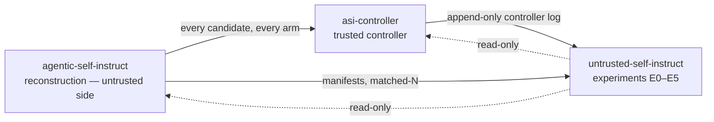
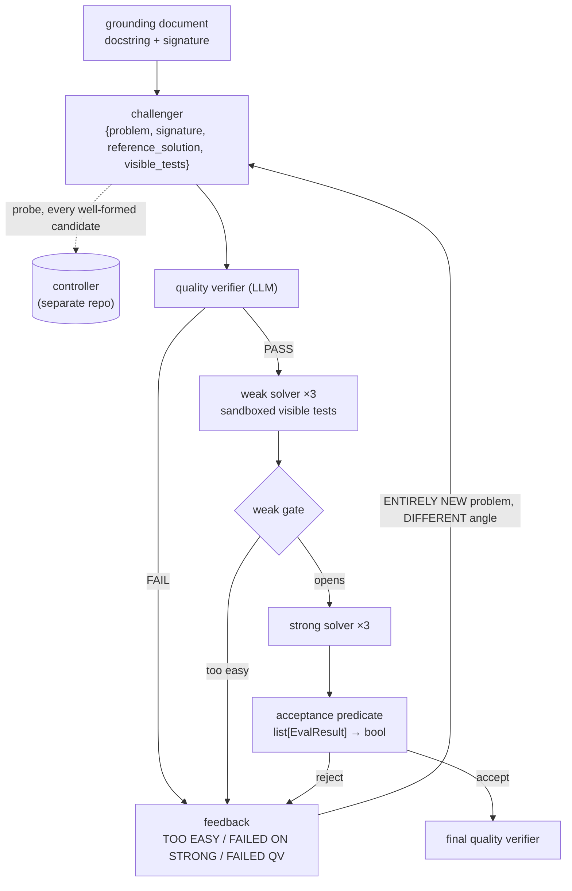
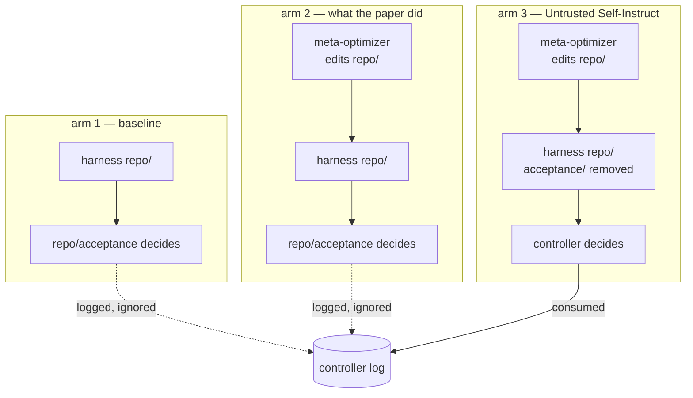

# agentic-self-instruct

Reconstruction of **Agentic Self-Instruct** from Kulikov et al.,
*Autodata: An agentic data scientist to create high quality synthetic data*
(arXiv:2606.25996v2), re-targeted from CS research QA to verifiable code and
instrumented so the acceptance predicate can run either inside the agent's
mutable harness or in a separate trusted controller.

This is a reconstruction, built from the paper. There is no official code
release. Every departure from the paper is recorded in
[`docs/fidelity.md`](docs/fidelity.md), which is load-bearing — read it before
trusting anything here.

## Three repositories

This is the **untrusted side** of Untrusted Self-Instruct. The trusted
controller and the experiments live in their own repositories and are cloned
side by side.

| repository | role |
|---|---|
| [agentic-self-instruct](https://github.com/hossainpazooki/agentic-self-instruct) | this repo — the reconstruction: harness, meta-optimizer, runner, fake backend |
| [asi-controller](https://github.com/hossainpazooki/asi-controller) | the trusted controller: a predicate the harness cannot run, an append-only log |
| [untrusted-self-instruct](https://github.com/hossainpazooki/untrusted-self-instruct) | experiments E0–E5, read-only over the other two |



## Layout

```
repo/          MUTABLE -- the agent's harness, and the meta-optimizer's edit surface
  orchestrator/  loop control, feedback composition
  challenger/    prompt + schema
  verifier/      quality-verifier prompt + schema (editable by the optimizer)
  solvers/       weak/strong clients, sampling config
  judge/         sandbox runner for visible tests
  acceptance/    the predicate; PRESENT in arms 1-2, ABSENT in arm 3
  meta_opt/      the Section 4 optimizer
shared/        the EvalResult contract and the run manifest
models/        model clients: protocol, vLLM, deterministic fake
corpus/        CodeSearchNet grounding documents
runner/        arm wiring, filesystem isolation, matched-N, smoke driver
```

The controller lives in a **separate repository**, `../asi-controller`. Nothing
under `repo/` may import it.

Vocabulary: "harness" means the agent's mutable scaffold (`repo/`). The
controller is never called a harness.

## The loop

One grounding document, up to `step_budget` rounds. The controller probe fires
on every well-formed candidate **before** solver dispatch, so the weak-first
short-circuit never hides a candidate from the got-away audit.



## Contract

Every check anywhere in the system emits
`EvalResult(name, passed, score, threshold, details)`. The acceptance
predicate, in either location, is a pure function `list[EvalResult] -> bool`.
No check writes an acceptance bit directly.

## Arms

| Arm | Acceptance predicate | Meta-optimizer |
|-----|----------------------|----------------|
| 1   | `repo/acceptance/`   | disabled       |
| 2   | `repo/acceptance/`   | enabled        |
| 3   | `controller/predicate.py` (repo's removed) | enabled |



The controller runs on every candidate in every arm. Arms 1 and 2 log its
verdict and ignore it; arm 3 consumes it. That is what makes the got-away audit
free.

## Running

Clone the repositories **side by side**; the smoke driver and the controller
suite both resolve the sibling by relative path.

```bash
git clone https://github.com/hossainpazooki/agentic-self-instruct.git
git clone https://github.com/hossainpazooki/asi-controller.git

cd agentic-self-instruct
pytest                                   # this repo
pytest ../asi-controller/tests           # the controller
python -m runner.smoke --documents 20    # three-arm smoke
```

The controller store is append-only, so a rerun needs a fresh
`--output <dir>`; the driver refuses a populated one up front.

The smoke runs against a deterministic fake backend: this host has no discrete
GPU. A green smoke shows the wiring holds, and says nothing about data quality.
